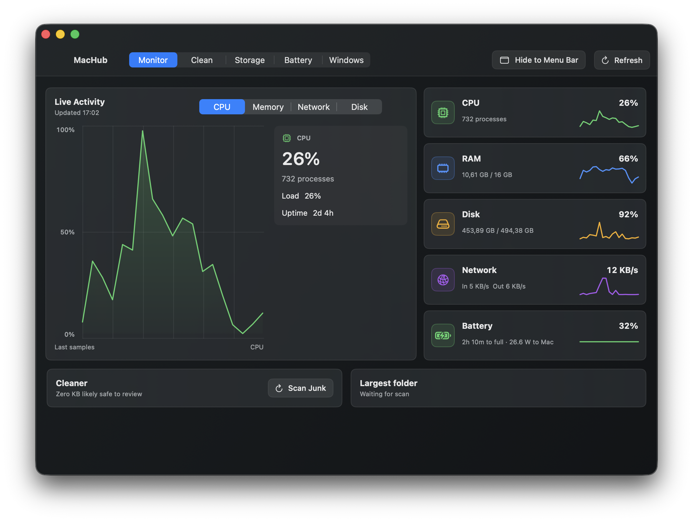
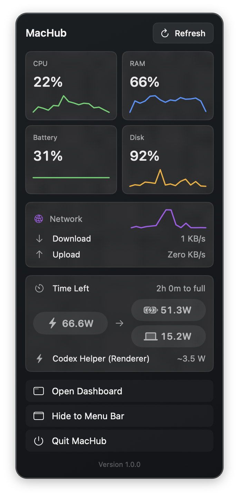
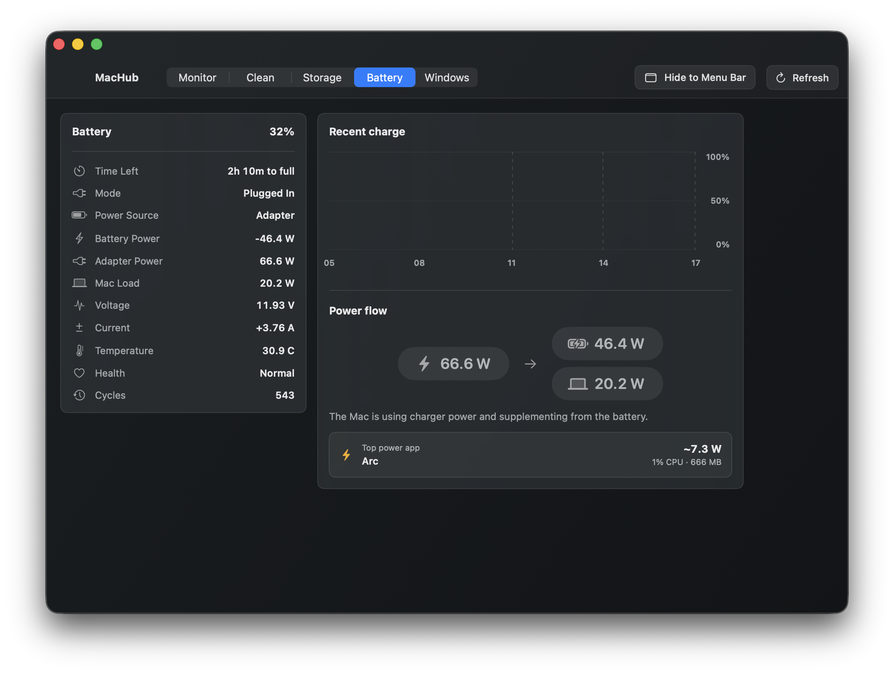

# MacHub

MacHub is a native macOS menu bar utility for keeping an eye on system health, battery power flow, storage, cleanup targets, and window layout shortcuts.

<p align="center">
  
</p>

<p align="center">
  
</p>

<p align="center">
  
</p>

## Features

- Live CPU, RAM, disk, network, battery, GPU, uptime, and process readings.
- Menu bar panel with compact metric sparklines and battery history over hours.
- Live power flow for adapter input, battery charge, and Mac load using AppleSMC telemetry.
- Battery view with charge trend, time remaining, watts, health, cycles, voltage, current, and temperature.
- Storage explorer for scanning common folders and drilling into large items.
- Cleaner view for reviewing caches, logs, DerivedData, downloads, and Trash before opening or removing them.
- Window tools for resizing the focused app via Accessibility APIs and editable global shortcuts.
- Dock/menu bar behavior: dashboard launch shows the Dock icon, while Hide to Menu Bar tucks the app back into the menu bar.

## Screenshots

The README visuals are captured from the current MacHub UI and live in [docs/screenshots](docs/screenshots).

## Requirements

- macOS 14 or later
- Swift 5.9 or later
- Accessibility permission for window arrangement shortcuts
- Full Disk Access for complete cleanup and storage scans

## Build And Run

Build from the repository root:

```bash
swift build
```

Create, install, and launch `/Applications/MacHub.app`:

```bash
script/build_and_run.sh
```

Install or replace `/Applications/MacHub.app` without launching:

```bash
script/build_and_run.sh --install
```

Verify that the app builds and launches:

```bash
script/build_and_run.sh --verify
```

## Permissions

- **Accessibility** is required for window snapping. MacHub uses the macOS Accessibility API to find the focused window and set its size and position.
- **Full Disk Access** is required before MacHub scans protected folders such as Downloads, Documents, Desktop, and Library data.

During development, `script/build_and_run.sh` signs the app with the first available Apple Development identity so macOS privacy permissions stay attached to the same `/Applications/MacHub.app` identity.
