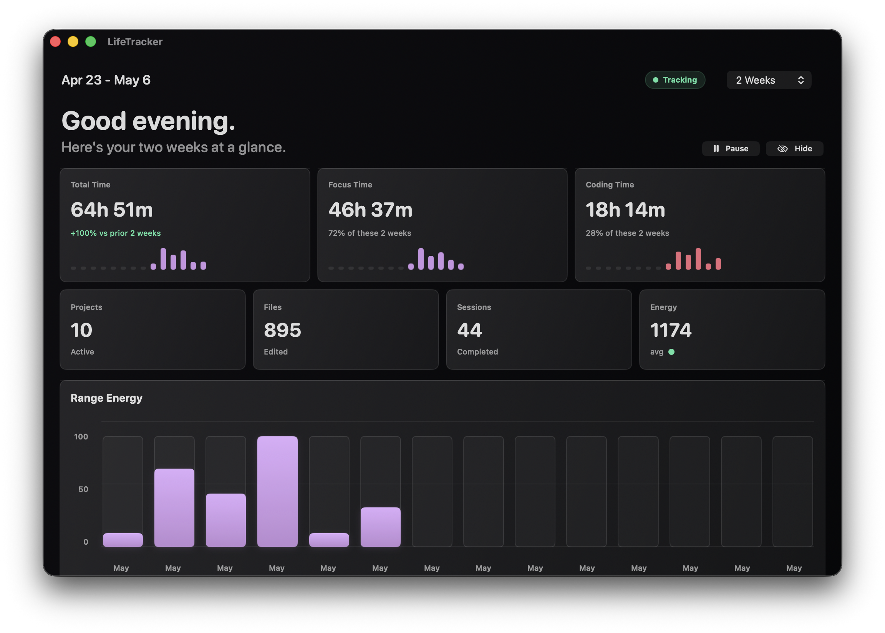
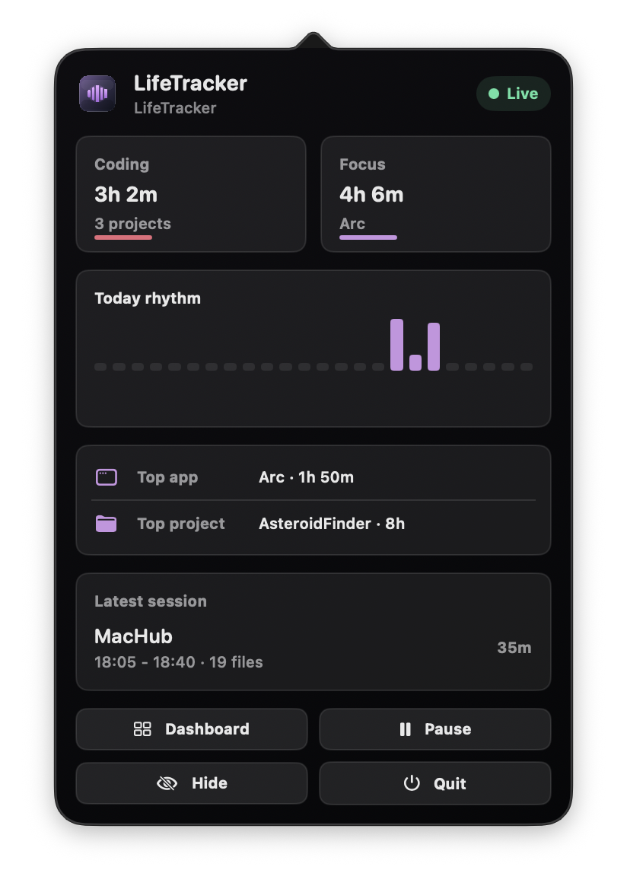

# MacHub





## Features

- Live CPU, RAM, disk, network, and battery readings with compact sparklines.
- Menu bar panel with fast system snapshots, power flow, top power app estimate, and dashboard actions.
- Cleaner view for reviewing caches, logs, derived data, downloads, and Trash before opening or removing them.
- Storage explorer for scanning common folders and drilling into large items.
- Battery view with charge history, time remaining, watts in/out, health, cycles, voltage, current, and temperature.
- Window tools for resizing the frontmost app, including editable global shortcuts.
- Dock/menu bar behavior: the Dock icon is visible while the dashboard is open and hidden when the app is tucked into the menu bar.

## Requirements

- macOS 14 or later
- Swift 5.9 or later
- Accessibility permission for window arrangement shortcuts
- Full Disk Access for more complete cleanup and storage scans

## Build And Run

Build from the repository root:

```bash
swift build
```

Create and launch the local `.app` bundle:

```bash
script/build_and_run.sh
```

Install or replace `/Applications/MacHub.app` with the current build:

```bash
script/build_and_run.sh --install
```

Verify that the app builds and launches:

```bash
script/build_and_run.sh --verify
```
